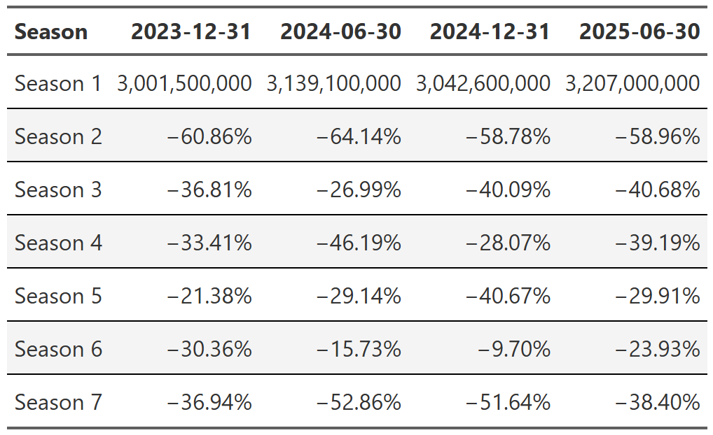
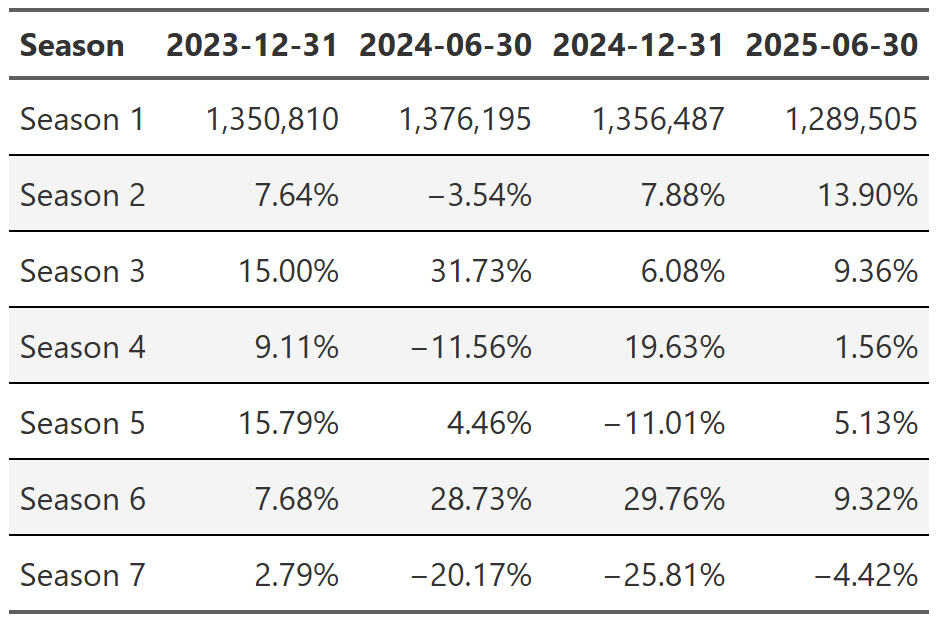

Every so often I like to take a look at datasets from the TidyTuesday project. If you are unaware, TidyTuesday is a social data
project where every week a dataset is collected and posted for analysis by the R community. People will dive in to do simple(or complex)
one-off analyses and visualizations and then post them under the #TidyTuesday hashtag to share with the community. It's a great opportunity
to learn from others, riff on an idea you've been mulling over, or just to practice on readily available, interesting datasets.

A couple months ago I was analyzing some [Seattle Public Library data](https://ahoulette.com/posts/seattle-library-analysis/) and I wanted to 
see how wide a swath of books people read. One approach I came up with was, essentially, taking the number of checkouts of every book, ordering them
highest to lowest and then calculating a cumulative sum of book checkouts[^ecdf]. With that information I could create the really interesting plot in @fig-one.

[^ecdf]: If you are reading carefully, you're probably saying "isn't that just an empirical cumulative density function plot"? The answer is pretty much yes, but the 
x-axis is a little different. Stay with me and I'll get into the differences in a moment.

{#fig-one .lightbox}

Basically, the left plot shows the number of books it takes to reach a certain(in this instance 75%) percentage of total checkouts and the right plot zooms 
in and shows the proportion of total checkouts the top 100 books represents. 
When I wrote that Seattle library post, I thought that the cumulative book share plot was a pretty interesting way of visualizing the relatively
common phenomenon where a small handful of books/movies/shows/videos/games/etc make up a huge portion of the total consumption of a media medium,
but the medium has an extremely long, thin tail after those initial popular items. For the Seattle library, ~25k books may make up 75% of checkouts, 
but there are ~275k *more* books that make up the remaining 25%.

Enter TidyTuesday datasets. The July 29th, 2025 tidytuesday [dataset](https://github.com/rfordatascience/tidytuesday/blob/main/data/2025/2025-07-29/readme.md) 
was a bundling of the engagement reports that Netflix releases every 6 months. This dataset featured, according to Netflix, 99% of all viewing of movies and shows
for each 6 month period from July 2023 - June 2025. When I first found this dataset I was just finishing up my Seattle library post, but I immediately knew 
I wanted to see what the cumulative share plots would reveal for the Netflix data. So in this post I have two 'simple' goals: 

1) Visualize the show data through the lens of cumulative viewing plots to see how long the tail of the Netflix show library is.
2) Explore how the viewing of shows changes across the four engagement reports present in the dataset. This is a relatively open-ended question and will
need to be clarified and scoped when I get to it.

So let's dive in and see what the data reveals!

## Data Import and Cleaning

```{r, table_formating_functions, echo = FALSE}
# format the numbers displayed in a table
format_table_numbers <- function(table){
    table |>
      fmt_percent(
        columns = everything(),
        decimals = 2,
        scale_values = FALSE
      ) 
}
# format the header of a table
format_table_header <- function(table) {
  table |>  
    tab_style(
      style = list(
        cell_text(weight = 'bold',
                  transform = 'capitalize'
        )
      ),
      locations = cells_column_labels(everything())
    )
}

# format the styling of a table
format_table_style <- function(table){
  table |> 
    tab_style(
      style = cell_borders(
        sides = c("top", "bottom")),
      locations = cells_body()) |> 
    opt_stylize(add_row_striping = TRUE, color = 'gray')|> 
    tab_options(quarto.disable_processing = TRUE)
}
```

```{r, data-import}
#| message: false
#| warning: false

library(tidyverse)
library(patchwork)
library(gt)
shows <- readr::read_csv('https://raw.githubusercontent.com/rfordatascience/tidytuesday/main/data/2025/2025-07-29/shows.csv')
```

```{r, data-cleaning}
calculate_days_since_release <- function(df){
    # determines the number of days between the release date and the 
    # last day of the reporting period
    df |> 
        group_by(report) |> 
        mutate(
            report_date = case_when(
                report == "2025Jan-Jun" ~ as.Date("2025-06-30"),
                report == "2024Jul-Dec" ~ as.Date("2024-12-31"),
                report == "2024Jan-Jun" ~ as.Date("2024-06-30"),
                report == "2023Jul-Dec" ~ as.Date("2023-12-31")
            ),
            days_since_release = case_when(
                is.na(release_date) ~ NA,
                .default = as.numeric(report_date - release_date)))
}

shows_cleaned <- shows |> 
    calculate_days_since_release() |> 
    ungroup() |> 
    select(report, title, release_date:days_since_release) |> 
    mutate(title = case_when(
        title == 'Stranger Things 4' ~ 'Stranger Things: Season 4',
        title == 'Stranger Things 3' ~ 'Stranger Things: Season 3',
        title == 'Stranger Things 2' ~ 'Stranger Things: Season 2',
        title == 'Stranger Things' ~ 'Stranger Things: Season 1',
        .default = title
    )) |> 
    mutate(title = str_remove_all(title, " \\/\\/.*")) |> 
    mutate(
        series = case_when(
            !grepl(":", title) ~ title, 
            .default = str_split_i(title, ":", 1)), 
        season = case_when(
            !grepl(":", title) ~ NA,
            .default = str_split_i(title, ": ", 2)
        ),
        season_number = case_when(
            str_detect(season, "Season|Part|Collection|Volume|Chapter.*") == TRUE ~ str_extract(season, "[0-9]+"),
            .default = NA
        )) |> 
    group_by(series) |> 
    mutate(total_seasons = as.integer(max(season_number, na.rm = TRUE)),
           report_date = as.factor(report_date)
           ) |> 
    ungroup() |> 
    group_by(series, report_date, seasonal_tag = str_detect(season, "Season|Part|Collection|Volume|Chapter.*") == TRUE) |> 
    mutate(new_release = case_when(
           days_since_release < 182  ~ 'New Season',
           any(days_since_release < 182) ~ 'New Season Lift',
           .default = 'Maintenance')) |> 
    ungroup() |> 
    group_by(series) |> 
    mutate(show_type = case_when(
        is.na(max(total_seasons))  ~ 'Limited Release',
        max(season_number) == 1 ~ 'Initial Season',
        max(season_number, na.rm = TRUE) > 1 ~ 'Multi Season'
    )) |> 
    select(-seasonal_tag)
```

First things first, after loading the show data, I need to do some cleaning. You can examine the code in the fold above for the details, but the highlights are: 

* Creation of *days_since_release* variable indicating the number of days between the given(if available) release date and the last day of the reporting period.
* Various data cleaning steps to create several new variables:
    * **Series**: The base tv series name
    * **Season**: The season, if applicable, of the series
    * **Season Number**: The season number, if applicable, of the series
    * **Total Seasons**: The total number of seasons a series contains
    * **New Release**: Variable dealing with how far from its release date the show was during a specific reporting period.
        * **New Season**: Show was released within 182 days of the report date
        * **Maintenance**: Show was released more than 182 days from the report date
        * **New Season Lift**: Show is part of a multi-season series that had a new season release within 182
            days of the report date.
    * **Show Type**: Variable classifying shows into one of three types:
        * **Limited Release**: Shows designed to be one-off, single season series. Think of these as glorified mini-series.
        * **Initial Season**: First(and only, so far) season of a show designed from the get go as a multi-season series.
        * **Multi Season**:  Show with multiple seasons in the dateset already.

After this cleaning the dataset has more useful indicator variables I can use to tease out information.

## Cumulative Views Plots for Netflix Shows

```{r, plot_base_theme}
my_plot_theme <- function(base_family="Karla", 
                          base_size =12,
                          plot_title_family='Karla',
                          plot_title_size = 20,
                          grid_col='#dadada') { 
  aplot <- ggplot2::theme_minimal(base_family=base_family, base_size=base_size) #piggyback on theme_minimal 
  aplot <- aplot + theme(panel.grid=element_line(color=grid_col))
  aplot <- aplot + theme(plot.title=element_text(size=plot_title_size, 
                                                 family=plot_title_family))
  aplot <- aplot + theme(axis.ticks = element_blank())
  aplot
}
```

```{r, cumulative_sum_calcuations}
calculate_grouped_cumulative_sum <- function(df, grouping_var, grouped_cumsum = TRUE){
    # Returns original dataframe with new variables:
    # view_share: a cumulative sum, grouped or ungrouped based on grouping_var and grouped_cumsum,
    #  counting the percentage of total views a show accounts for. 
    #     -Totals to 1 if grouped_cumsum = TRUE; otherwise totals to the share of the total each member of the 
    #       grouping_var represents. 

    working_df <- df |> 
        filter(!is.na(views)) 
        
    # grouped_cumsum = TRUE indicates we want to have a different cumulative sum calculation for
    # each group in grouping_var.
    #     -This means each group will have a sum that totals to 1 and a corresponding plot that ranges from
    #      0 to 1
    if(grouped_cumsum){
        working_df    |> 
            group_by({{grouping_var}}) |> 
            arrange(desc(views)) |> 
            mutate(view_share = cumsum(views)/sum(views),
                row_num = row_number())
    }else{
    # grouped_cumsum = FALSE indicates we want a single cumulative sum calculation, but we want to be able
    # to manage each group in the grouping_var as a different portion of the whole. All the groups will add 
    # to 1.
    #      - The aggregation of the grooups will sum to 1 and corresponding plots will show groups not 
    #      - spanning the 0 to 1 range.
        working_df |> 
            group_by({{grouping_var}}) |> 
            arrange(desc(views)) |> 
            mutate(view_running_total = cumsum(views),
                   row_num = row_number()) |> 
            ungroup() |> 
            mutate(view_share = view_running_total/ sum(views))
    }
}
```

```{r, cumulative_views_plots}
full_shows <- shows_cleaned |> 
    calculate_grouped_cumulative_sum(grouping_var = report, grouped_cumsum = TRUE) |> 
    ggplot(aes(x = row_num, y = view_share, color = report))+
    geom_line(linewidth = .8)+
    my_plot_theme()+
    labs(x = "# of shows",
         y = "Proportion of Total Views",
         color = 'Reporting period',
         title = '75% of all views are captured by ~25% of the Netflix show library',
         subtitle = 'The remaining 75% of the library captures only 25% of views'
         )+
    scale_y_continuous(label = scales::percent_format())+
    scale_x_continuous(label = scales::label_comma())+
    geom_hline(yintercept = .75, linetype = 'dashed', color = 'gray8')+
    theme(
        legend.position = 'inside',
        legend.key.width = unit(10, 'mm'),
        legend.position.inside = c(.9, .15)
    )

top_100_shows <- shows_cleaned |> 
    calculate_grouped_cumulative_sum(grouping_var = report, grouped_cumsum = TRUE) |> 
    filter(row_num <= 100) |> 
    ggplot(aes(x = row_num, y = view_share, color = report))+
    geom_line(linewidth = .8)+
    my_plot_theme()+
    geom_vline(xintercept = 100, color = 'black')+
    labs(x = "# of shows",
         y = "",
         color = 'Reporting period',
         subtitle = 'The top 100 shows capture ~25% of all views'
         )+
    scale_y_continuous(label = scales::percent_format())+
    scale_x_continuous(label = scales::label_comma())+
    theme(
        legend.position = 'None'
    )

proportion_of_views_plot <- (full_shows + top_100_shows) +
    plot_annotation(tag_levels = "A", tag_prefix = "(", tag_suffix = ")") & theme(plot.tag.position = 'bottom')  

# ggsave("proportion_of_views_plot.png", proportion_of_views_plot, width = 10, height = 8)
```
As I mentioned in the introduction, my concept of a cumulative share plot is fairly straightforward. I order the shows from most to least views and calculate
a cumulative sum, which then gets divided by the total number of views. Say what now?? Let's look at a toy example. Say I have three
shows in my dataset. Their view counts are as follows:
    
* **Show A**: 150 views
* **Show B**: 375 views
* **Show C**: 75 views

So I would order from high to low (B -> A -> C), then cumulatively sum them, and then divide by the total, 600. The results would be:
    
* **Show B**: .625
* **Show A**: .875
* **Show C**: 1.0

In this toy example, show A accounts for 62.5% of all views, show A + show B account for 87.5% of all views and show A + B + C account for 100% of all views.
What this allows me to do is to ask questions like 'How many shows does it take to equal 75% of the total view count?'

{.lightbox #fig-two}

That is essentially how @fig-two can be interpreted: how many distinct shows[^seasons] does it take to reach 75% of all views. In plot A, we can see the answer is
roughly 1,300 shows. Plot B simply zooms in and looks at what percentage of views the top 100 shows capture-roughly 25%. These numbers immediately perked my ears up because
they are strikingly close to following the [pareto principle](https://en.wikipedia.org/wiki/Pareto_principle).
The pareto principle says that 20% of some cause(in this case shows) accounts for 80% of the consequences(in our case views). This concept is closely related to power laws
and we should be able to check if our distribution follows a power law by [scaling both our x and y axes logarithmically](https://clauswilke.com/dataviz/ecdf-qq.html)
and checking to see if the data follows a straight line.

[^seasons]: Our dataset treats different seasons of a series as different shows. For example, Bridgerton: Season 1 and Bridgerton: Season 2 are two distinct shows.


```{r, cumulative_views_logged_axes}
logged_plot <- shows_cleaned |> 
    calculate_grouped_cumulative_sum(grouping_var = report, grouped_cumsum = TRUE) |> 
    ggplot(aes(x = row_num, y = view_share, color = report))+
    geom_line(linewidth = .8)+
    my_plot_theme()+
    labs(x = "# of shows",
         y = "Proportion of Total Views",
         color = 'Reporting period',
         title = '75% of all views are captured by ~25% of the Netflix show library',
         subtitle = 'The remaining 75% of the library captures only 25% of views'
         )+
    geom_hline(yintercept = .75, linetype = 'dashed', color = 'gray8')+
    theme(
        legend.position = 'inside',
        legend.key.width = unit(10, 'mm'),
        legend.position.inside = c(.9, .15)
    )+
    scale_x_log10(label = scales::label_comma())+ 
    scale_y_log10(label = scales::percent_format())
ggsave("logged_plot.png", logged_plot, width = 10, height = 8)
```

{.lightbox #fig-three}

The data in @fig-three *almost* follows a straight line, but not quite. That should mean it doesn't follow a power law,
but it sure is close. This isn't a satisfying answer, but I couldn't put my finger on what exactly bothered me. After an embarassingly long
time, I think I realized what is going on. My insight came when I reread the #tidytuesday [data dictionary](https://github.com/rfordatascience/tidytuesday/blob/main/data/2025/2025-07-29/readme.md):
 *"This report, which captures ~99% of all viewing in the first half of 2025"*. I knew that, but I missed a fairly obvious implication of that
 seemingly minor detail. To see what I mean we need some quick napkin math. 
 
The 2025 Jan-June report in our dataset(one of four six month report periods) has a total of roughly 10.5 billion views and 7,500 shows. 
If 99% of viewing is ~10.5 billion total views, that last percent is probably something like ~100 million views. Given that 
~1,900 of the 7,500 shows in the report have 100,000 views(the lowest amount shown in our dataset), it seems logical to assume that most/all of the
shows in the excluded 1% have fewer than 100,000 views and thus we could be looking at potentially thousands of shows which were excluded from
the report.  I can't say for sure since Netflix, to my knowledge, doesn't make a list of their full library publicly available, but it sure seems
like we are dealing with a dataset that is a lot more truncated than it appears--at least for the really specific purpose I'm using it for.
I think this effect could be even larger given that not only do the tails appear to be quite truncated, but the view counts themselves are heavily
rounded and/or binned. ~1,900 shows didn't all miraculously have *exactly* 100,000 views. That is some form of rounding and/or binning and 
without knowing more specifics about the methodology and the missing 1% of views I don't think I can conclusively say whether the distribution follows
a power law or not.

All the power law shenaigans aside, this is still, I think, a really interesting result. Just 100 shows are needed to cover nearly 25% of all views on 
Netflix. That is mindboggling and brings up so many questions. Perhaps the one I'm most interested in--but one which I can't remotely answer with the
data in this dataset--is how do these viewing rates relate to the way Netflix displays shows to you. For example, when Stranger Things has a new season,
you can be sure that it will show up on the landing page when you open Netflix, probably for quite some time. That placement on an immediately visible
and accessible page definitely promotes viewership, but by how much exactly? And on the other side of things, how much does a show being hidden 15
rows deep(or not displayed at all in Netflix's suggested shows) hinder viewership? Inside Netflix I am sure there are whole analytics teams doing A/B testing
to figure these sorts of numbers out, but man I would love to get my hands on the data I'd need for this sort of analysis.

### A Brief Note on Empirical Cumulative Distribution Functions
As I noted in the introduction, my cumulative view plots sure sound an awful lot like an empirical cumulative distribution function. And that's
true, they are similar, but subtly different. To see the difference in their interpretation, let's look at them side by side.

```{r, cumulative_view_ecdf_comparison_plot}
ecdf_plot <- shows_cleaned |> 
    filter(!is.na(views)) |> 
    ggplot(aes(x = views, color = report))+
    stat_ecdf(pad = FALSE, linewidth = .8)+
    geom_vline(xintercept = 10000000, linetype = 'dashed')+
    annotate('text', x = 75000000, y = .95, label = '~97% of shows have 10 million views or fewer')+
    my_plot_theme()+
    scale_x_continuous(labels = scales::label_number(scale_cut = scales::cut_short_scale()))+
    scale_y_continuous(labels = scales::percent_format())+
    theme(
        legend.position = 'inside',
        legend.key.width = unit(10, 'mm'),
        legend.position.inside = c(.8, .125)
    )+
    labs(x = '# of views(Millions)',
         y = 'ECDF',
         subtitle = 'ECDF plots display the proportion of shows\n that had X number of views or fewer',
         color = 'Reporting Period')

full_shows_ecdf_comp <- full_shows+
        labs(title = 'Comparison of Cumulative Viewing vs ECDF plots',
                 subtitle = 'Cumulative viewing plots display how many shows you\n must lump together to reach X proportion of total views')

comparison_plot <- (full_shows_ecdf_comp + ecdf_plot)+
    plot_annotation(tag_levels = "A", tag_prefix = "(", tag_suffix = ")") & theme(plot.tag.position = 'bottom') 
# ggsave('comparison_plot.png', comparison_plot, width = 10, height = 8)
```

{.lightbox #fig-four}

Plot A in @fig-four is the now familiar cumulative viewing plot. Moving from left to right on the plot, we are stacking
up the views of shows, always taking the next most viewed show, and adding them together to give us the cumulative
views of the X most viewed shows. So if we want to see how many shows are needed to reach 75% of all views, we just locate
where our curve intersects the 75% threshold and we get ~1,300 shows equal ~75% of total views.

In contrast, plot B in @fig-four asks 'how many shows have at least X views'? If we pick a X value, say 10 million views(illustrated by our dashed line),
we can say that everything to the left has fewer than 10 million views and everything to the right has 10 million views or more. With this, we can
say that 97% of shows had 10 million views or less. 

So as you can see, these are two distinct ways of quantifying the same metric-views. Their shapes look quite similar precisely because they are handling
the same information, but the way they are presenting it allows you to answer two different questions. With my cumulative views approach, it's easy to 
reason about questions like 'how much of total viewership is represented by X number of shows'? With the ECDF approach, it's easier to reason about individual
shows: 'how many shows got at least X views'? Which one of these is better? Well, neither. They just answer different questions and I think it's good to have 
them both in your toolbox.

One thing that pops out when viewing @fig-four, especially plot B, is how little detail we can see. If I squint I can tell what's going on in the middle regions, but 
out in the tails it's very difficult to extract detail. We can improve this by logging the axes like we did in @fig-three, but this time we are using the transformation to help us
interpret the plot, not to test for a power law.

```{r, logged_cumulative_view_ecdf_comparison_plot}
ecdf_log_plot <- shows_cleaned |> 
    filter(!is.na(views)) |> 
    ggplot(aes(x = views, color = report))+
    stat_ecdf(pad = FALSE, linewidth = .8)+
    geom_vline(xintercept = 10000000, linetype = 'dashed')+
    my_plot_theme()+
    scale_x_log10(labels = scales::label_number(scale_cut = scales::cut_short_scale()))+
    scale_y_log10(labels = scales::percent_format(), minor_breaks = scales::minor_breaks_log(detail = 1))+
    theme(
        legend.position = 'inside',
        legend.key.width = unit(10, 'mm'),
        legend.position.inside = c(.8, .125)
    )+
    labs(x = '# of views(Millions)',
         y = 'ECDF',
         subtitle = '',
         color = 'Reporting Period')

full_shows_ecdf_comp_logged <- full_shows+
        scale_x_log10()+ 
        scale_y_log10(labels = scales::label_percent(), minor_breaks = scales::minor_breaks_log(detail = 1))+
        labs(title = 'Comparison of Cumulative Viewing vs ECDF plots, logged axes',
                 subtitle = 'Logged axes reveal the binning of view counts in the ECDF plot and allows for a much more fine grained\n examination of the curves in both plots')

comparison_plot_logged <- (full_shows_ecdf_comp_logged + ecdf_log_plot)+
    plot_annotation(tag_levels = "A", tag_prefix = "(", tag_suffix = ")") & theme(plot.tag.position = 'bottom') 
# ggsave('comparison_plot_logged.png', comparison_plot_logged, width = 10, height = 8)
```

{.lightbox #fig-five}

With our axes logged, both plots offer greater detail of the tails. Plot B of @fig-five has a stepped appearance which indicates that the view
counts are discrete and binned. It's possible to examine data that was in the extreme tails in @fig-four but is now 
interpretable. For example, I can see that 70% of shows have 1 million views or less, a data point that was lost in the 
tail before.

## How Does Viewing Change Across Reports?

Now on to my second question: How does viewing change across the four reports in the dataset? What exactly is this question
asking? Do we want to know how Netflix's total viewership changes across the reporting periods? Or maybe we are more interested in how views for a single series
change across the four reports. Even there, do we want to know the season by season change or the total change in views across all seasons?
Perhaps we actually care about how views change when a new season of a show premiers. Do the other seasons of that series get a bump in views? 
How big is that bump?

As you can see, this seemingly simple question is not particularlly well specified. Since I'm in charge here(mwahaha), I'm going to divide this into 
two parts. Part one will look at the overall level of viewership: total views, total views for each season, total views for each report, that sort of thing.
Part two will look at viewership for individual series and seasons: does Stranger Things have a big drop in views from one season to the next; how much of a lift did a new season provide to old seasons of a show, questions of that sort.

Let's get started!

### Overall Netflix Viewership

Let's get started with a baseline. How much are people watching on Netflix and is that number going up or down.

```{r, total_views_by_report}
total_views_tbl <- shows_cleaned |> 
  ungroup() |> 
  summarise(total_views = sum(views, na.rm = TRUE), .by = report_date) |> 
  arrange(report_date) |> 
  mutate(dropoff = (total_views - lag(total_views, 1))/lag(total_views, 1) *100) |> 
  select(report_date, total_views, dropoff) |> 
  # rename is for better formatting of col names in table
  rename(`report date` = report_date, `total views` = total_views) |> 
  gt() |> 
  fmt_number(
    columns = `total views`,
    rows = everything(),
    decimals = 0
  ) |> 
  fmt_percent(
    columns = dropoff,
    rows = everything(),
    decimals = 3,
    scale_values = FALSE
  ) |> 
  format_table_header() |> 
  format_table_style()

# gtsave(total_views_tbl, 'total_views_tbl.png')
```

```{r, series_in_top_100_views_by_report}
top_shows_by_report <- shows_cleaned |> 
  ungroup() |> 
  arrange(desc(views)) |> 
  slice_head(n = 100) |> 
  group_by(report_date) |>
  count() |> 
  ungroup() |> 
  rename(`# shows` = n,
         `report date` = report_date) |> 
  gt() |> 
  format_table_header() |> 
  format_table_style()

# gtsave(top_shows_by_report, 'top_shows_by_report.png')
```

{.lightbox #tbl-total-views}

@tbl-total-views is simply the sum of all views in each reporting period. As a reminder, these reports are six month
periods, so, for example, report date 2025-06-30 is the viewing period from January to the end of June in 2025.
Viewing is relatively flat until the last report where we see a big 6.5% bump. Intuitively 6.5%
seems like a big increase from one six month period to the next, so I quickly looked at the 100 most viewed
shows in the dataset and grouped them by report date[^most-viewed-note]. @tbl-most-viewed-shows is the result.
I don't know what happened, but the 2025 report had significantly more top shows than any of the
previous reports. If you add up the viewership of these 100 shows most of the 6.5% difference appears to come
from this small group of shows. The 2025 report period has ~500 million more views from these top 100 shows than
any other report. I'm not going to dive into this, but it's something to keep in mind.

[^most-viewed-note]: This is not a perfect way to do this grouping. Most, but not all, of the time this
grouping captures which period the show debuted in. A small handful of times- when the show debuted before
any of these reports or when a new season massively bumps an old season-a show that debuted in a older
report will get mistakenly grouped with a newer report. After reviewing the data it didn't make any difference
in this case, so I went ahead with this simpler, imperfect grouping.

{.lightbox #tbl-most-viewed-shows}

### Total Seasonal Viewing

```{r, table_building_functions}
# calculates dropoff rate of shows by specified grouping variables
# can be many different variables, but this logic is still fairly brittle, so use with caution
calc_table_data <- function(data, summary_func = sum,  ...){
  
  grouping_vars <- enquos(...)
  
  # create naming variables to handle the summary_func possibilities
  stat_name <- as_label(enquo(summary_func))
  display_name <- if(stat_name == 'sum') 'total' else stat_name
  col_name <- rlang::sym(glue::glue("{display_name}_views"))
  

  working_df <- data |>
      # data should be ungrouped coming into this function, but explicitly ungroup for safety
      ungroup() |>
      group_by(!!!grouping_vars) |>
      mutate(contains_new_season = case_when(
                                    new_release %in% c("New Season", "New Season Lift") ~ TRUE,
                                    .default = FALSE)) |>
      summarise(!!col_name := rlang::exec(summary_func, views, na.rm = TRUE),
                contains_new_season = any(contains_new_season),# logical flag per series per report_date
                .groups = 'drop')  |>
      arrange(!!!grouping_vars)
  
  if(length(grouping_vars) > 1){
    final_df <- working_df |> 
      group_by(!!grouping_vars[[1]]) |>
        mutate(dropoff = (!!col_name - lag(!!col_name, 1))/lag(!!col_name, 1) *100,
               dropoff = if_else(is.na(dropoff), !!col_name, dropoff),
               is_first_row = row_number() == 1,
               ) |>
        ungroup() |>
        complete(!!!grouping_vars, fill = list(contains_new_season = FALSE))
      final_df
      
  }else{
  final_df <- working_df |> 
    ungroup() |>
      mutate(dropoff = (!!col_name - lag(!!col_name, 1))/lag(!!col_name, 1) *100,
             dropoff = if_else(is.na(dropoff), !!col_name, dropoff),
             is_first_row = row_number() == 1,
             ) |>
      ungroup() |>
      complete(!!!grouping_vars, fill = list(contains_new_season = FALSE))
  final_df
  }

}    

build_formatted_table <- function(data, add_conditional_highlights = TRUE, ...){
  groups <- enquos(...)
  
  base_table <- data |>
      select(!!!groups, dropoff) |>
      pivot_wider(names_from = !!groups[[1]], values_from = dropoff) |>
      gt() 
  
  # create a set of named vectors containing the logic for conditionally formatting table
  conditional_formatting_flag <- data |> 
    group_by(!!groups[[1]]) |> 
    summarise(
      logic_data = list(
        list(
          new_season_flag = contains_new_season,
          first_row_flag = is_first_row
      )), .groups = "drop") |> 
    deframe()
  
  # build conditionally formatted table
  final_table <- 
    reduce(
        names(conditional_formatting_flag),
        .init = base_table,
        function(gt_obj, current_item){
          
          #gather conditional flags
          flags <- conditional_formatting_flag[[current_item]]
          
          
          result <- gt_obj |> 
            fmt_number(
              columns = all_of(current_item),
              rows = flags$first_row_flag,
              decimals = 0
            ) |> 
            fmt_percent(
              columns = all_of(current_item),
              rows = !flags$first_row_flag,
              decimals = 2,
              scale_values = FALSE
            )
          
          if(add_conditional_highlights){
            result <- result |> 
              tab_style(
                style = cell_fill(color = 'white'),
                locations = cells_body(
                  columns = all_of(current_item),
                  rows = flags$first_row_flag
                )
              ) |> 
              #apply new season formatting
              tab_style(
                style = cell_fill(color = 'yellow', alpha = .5),
                locations = cells_body(
                  columns = all_of(current_item),
                  rows = flags$new_season_flag 
                )
              )
          }
          return(result)
          }
    )
    final_table |>
      format_table_header() |>
      format_table_style()
}
```


#### Across Reports

If we want to peel away one layer of aggregation[^tbl-building-functions] we need to decide whether it's better to look across reports or across seasons. Since our question of interest is 'how does viewing change across the four reports', it seems logical to start by looking across reports. At this point we are still dealing with totals, so when we look across reports we are saying:  for the 2025 report, all first seasons of shows had 3.2 billion total views. Views for all second seasons fell 58.9% from that season one number; views for all third seasons fell 40.6% from the season two number. It continues on this way all the way down to season seven[^seven-seasons]. This is the information displayed in @tbl-across-report. Views steadily decline from season 1 onward in each report period. If you start with ~3 billion views of season 1, you can expect to have somewhere around 100-150 million views of season 7.

```{r, across_report_aggregated}
across_report_date_total <- shows_cleaned |> 
  ungroup() |> 
  filter(season %in% paste0("Season ", 1:7)) |>
  calc_table_data(report_date, season, summary_func = sum) |>  
  build_formatted_table(add_conditional_highlights = FALSE, report_date, season)

# gtsave(across_report_date_total, "across_report_date_total.png")
```

{.lightbox #tbl-across-report}

This is kinda interesting, but after thinking about it for a second, you'll probably realize the same thing I did. Aren't there way more shows that have a season 1 than a season 7?

```{r, number_of_shows_with_season_x}
show_count <- shows_cleaned |> 
  ungroup() |> 
  filter(season %in% paste0("Season ", 1:7)) |> 
  summarise(total_shows = n(), .by = c(report_date, season)) |> 
  arrange(report_date, season) |> 
  filter(report_date == '2023-12-31') |> 
  gt() |> 
  format_table_header() |> 
  fmt_number(
    columns = total_shows,
    rows = everything(),
    decimals = 0
  ) 

# gtsave(show_count, "show_count.png")
```

As you can see from @tbl-season-cohort, yes! This significantly changes the interpretation. 
Now it's not  'season 1's get viewed so much more often than other seasons', it's 'there are so many more season 1's in the 
dataset that they have significantly higher total views'. This is a perfectly fine interpretation
of this way of slicing the data, but it's pretty unsatisfying. We know that more shows in a cohort probably results in more 
total views. That seems relatively obvious. I think the question people actually want answered from this sort of framing
though is 'on average, how big of an increase/decrease do we expect to see from season 1 to season 2, and does this number vary
across reports'? To get at that question, we need something like the average(or median) views for each season by report.


{.lightbox #tbl-season-cohort}


```{r, avg_views_by_season_x_reports}
avg_views <- shows_cleaned |> 
  ungroup() |> 
  filter(season %in% paste0("Season ", 1:7)) |> 
  calc_table_data( report_date, season, summary_func = mean) |> 
  build_formatted_table(add_conditional_highlights = FALSE, report_date, season)

# gtsave(avg_views, "avg_views.png")
```


@tbl-avg-views-reports provides that information. With this we can say that, on average, in the 2025 report season 2's have 13.9% increased viewership compared to season 1's. As you can see in the table though, these numbers bounce around all over the place. This sort of thing perks my ears up and makes me think that either something is wrong or that this perhaps isn't a great way of analysing the information. Let's think through why. So what @tbl-avg-views-reports is providing is the average views for all season one shows in each report. All the other rows provide the percent increase or decrease from the previous season's numbers. But as we saw earlier in @tbl-season-cohort, these seasonal cohorts contain vastly different numbers of shows. That means that season one will have tons of shows, from the most popular to barely watched shows that just fill out the library. Later seasons have selection bias built in. How do you get to the second, third, fourth, etc., season of a show? You have a really popular show! So, for example, season 7 has fewer shows to average over, but, more importantly, has already effectively filtered out those lower viewed shows because they never had a season 7 made. 

{.lightbox #tbl-avg-views-reports}


At the end of the day, I think this across report slicing of the data is a problematic way to go about answering 'how viewing changes across reports'. No matter which way you approach it, so much information is lost in the aggregation and so many different statistical biases creep into the tables that any meaningful conclusions are elusive. I don't think I can use this information to say our new series(season 1's) performed well and bumped up viewing in such-in-such report, nor can I say that our later seasons saw big increases in views and so we have a strong stable of shows that are growing their viewership. Ultimately, this slicing of the data won't provide those answers.

[^tbl-building-functions]: At this point, since I know I'm going to be building a lot of different tables, I'm
going to build a couple general purpose table functions to speed things up. I'm not going to go into their details,
but they are worth a look in the code fold if you are interested in reproducing some of this report.

[^seven-seasons]: Why did I stop at season 7? Well, I had to stop somewhere as some shows have over 20 seasons. Up to season 7-ish
there are still a lot of shows in the dataset so I felt relatively comfortable with the numbers being meaningful and not completely
driven by the behavior of one or two shows.


#### Across Seasons

Perhaps slicing the data across seasons will provide us with more useful information to address how viewing changed across the reports. How is slicing across seasons different from slicing across reports? Well, when we slice across seasons, each column in @tbl-across-season is now comparing how that specific season does in each report. So season 1's had ~3 billion views in the 2023 report, then about 4.5% more in the first half of 2024. So each row just tells how viewing increased or decreased from the last report--for that specific season. This is nice because we no longer have to worry about the fact that season 1's have 3 billion views and season 7's have 170 million. These totals are roughly the same magnitude in each report so we aren't just seeing an artifact of the fact that different season cohorts have different show counts. Can we say anything informative about how viewing has changed across the reports? I think the most we can gather from @tbl-across-season is that the views of a specific season cohort are relatively stable for early seasons and grow slightly more volatile as you go up in season number. As mentioned above, I think the smaller pool of shows in later season cohorts is the cause of this, but we can actually see evidence of that in the table.

```{r, all_seasonal_shows}
seasonal_all_shows <- shows_cleaned |> 
  filter(season %in% paste0("Season ", 1:7)) |>
  calc_table_data(season, report_date, summary_func = sum) |> 
  build_formatted_table(add_conditional_highlights = FALSE, season, report_date)

 # gtsave(seasonal_all_shows, "seasonal_all_shows.png")
```

{.lightbox #tbl-across-season}

If we want to see this more clearly, we can divide the data into two groups. Essentially we chunk up the data from each show by report date. If, for example, Black Mirror had a new season premier in 2025, then all seasons of Black mirror in the 2025 report go into the 'new season' group. In the other three reports, 2023 and the two 2024 periods, Black Mirror didn't have a new season premier, so those three chunks of Black Mirror data go into the 'no new seasons' group.  We do this for every show in the dataset and now we have two datasets, one full of shows that didn't have any new seasons during the report and one full of shows that did have new seasons. The results of this are @tbl-no-new-seasons and @tbl-only-new-seasons. 

```{r}
no_new_seasons <- shows_cleaned |> 
  filter(season %in% paste0("Season ", 1:7)) |>
  group_by(series, report_date) |> 
  filter(!any(new_release == 'New Season Lift')) |> 
  calc_table_data(season, report_date, summary_func = sum) |> 
  build_formatted_table(add_conditional_highlights = FALSE, season, report_date)

new_seasons <- shows_cleaned |> 
  filter(season %in% paste0("Season ", 1:7)) |>
  group_by(series, report_date) |> 
  filter(any(new_release == 'New Season Lift')) |> 
  calc_table_data(season, report_date, summary_func = sum) |> 
  build_formatted_table(add_conditional_highlights = FALSE, season, report_date)

# gtsave(no_new_seasons, "no_new_seasons.png")
# gtsave(new_seasons, "new_seasons.png")
```

{.lightbox #tbl-no-new-seasons}

{.lightbox #tbl-only-new-seasons}

What's immediately apparently to me from @tbl-no-new-seasons is how stable the totals are across the entire table. This is partly because we have a lot of data in the groups still, but even our later seasons have stabilized, so I don't think the effect is illusory. When you compare @tbl-no-new-seasons to @tbl-only-new-seasons the difference is night and day. Again, there is less data, so I expect these numbers to jump around more, but I guess I didn't expect the swings to be totally driven by whether or not a popular season of a show happened to premier during a certain report. 

```{r, eval = FALSE}
multi_report_shows |> 
  filter(series %in% c("Stranger Things", 'Seinfeld', 'Virgin River')) |> 
  calc_table_data(season, report_date, summary_func = mean) |> 
  build_formatted_table(add_conditional_highlights = TRUE, season, report_date)
```


###


```{r, popular_show_decay, eval = FALSE}
## Viewership decay
multi_report_shows <- shows_cleaned |> 
    group_by(series, season) |> 
    filter(n_distinct(report_date) == 4) |> 
    ungroup()

### sum total of show views(all seasons) each report
multi_report_shows |> 
    ungroup() |> 
    group_by(series, season) |>
    mutate(contains_new_season = case_when(
                                    new_release %in% c("New Season", "New Season Lift") ~ TRUE,
                                    .default = FALSE)) |>
    ungroup() |>
    filter(series %in% c("Bridgerton")) |>
    # filter(startsWith(title,'You:') | series %in% c('Stranger Things', 'Breaking Bad', 'Seinfeld')) |> 
    group_by(series, report_date) |> 
    summarise(total_views = sum(views)) |> 
    arrange(report_date) |> 
    mutate(subsequent_report_dropoff = (total_views - lag(total_views, 1))/lag(total_views, 1) *100) |> 
    pivot_wider(-total_views, names_from = series, values_from = subsequent_report_dropoff) |> 
    gt() |> 
    format_table_header() |> 
    format_table_numbers() |> 
    format_table_style() 

shows_cleaned |> 
  filter(season %in% paste0("Season ", 1:7)) |>
  filter(series %in% c("Virgin River")) |> 
  ungroup() |> 
  calc_table_data(grouping_var = season) |>
  build_formatted_table(grouping_var = season, add_conditional_highlights = TRUE)


# calculates dropoff rate of shows by a 'single' specified grouping variable
calc_table_data <- function(data, grouping_var = NULL){
  #when grouping_var is NULL, function is still grouping by report_date, but that is the only grouping
  
  group <- enquo(grouping_var)
  
  working_df <- data |> 
      # data should be ungrouped coming into this function, but explicitly ungroup for safety
      ungroup() |> 
      group_by(across(c(!!group, "report_date"))) |> 
      mutate(contains_new_season = case_when(
                                    new_release %in% c("New Season", "New Season Lift") ~ TRUE,
                                    .default = FALSE)) |> 
      summarise(total_views = sum(views, na.rm = TRUE),
                contains_new_season = any(contains_new_season),# logical flag per series per report_date
                .groups = 'drop') |> 
      arrange(!!group, report_date) |> 
      group_by(!!group) |> 
      mutate(dropoff = (total_views - lag(total_views, 1))/lag(total_views, 1) *100, 
             dropoff = if_else(is.na(dropoff), total_views, dropoff),
             is_first_row = row_number() == 1,
             ) |> 
      ungroup() |> 
      complete(!!group, report_date, fill = list(contains_new_season = FALSE))
  working_df
  
}    

build_formatted_table <- function(data, grouping_var, add_conditional_highlights = TRUE){
  group <- enquo(grouping_var)
  
  # nest data to get into form usable in reduce
  nested_data <- data |> 
      mutate(!!group := as.character(!!group)) |>
      group_by(!!group) |> 
      arrange(report_date) |> 
      nest()
  
  base_table <- data |>
      select(report_date, !!group, dropoff) |>
      rename(`report date` = report_date) |> 
      pivot_wider(names_from = !!group, values_from = dropoff) |>
      gt()
  
  # create a set of named vectors containing the logic for conditionally formatting table
  conditional_formatting_flag <- data |> 
    group_by(!!group) |> 
    summarise(
      logic_data = list(
        list(
          new_season_flag = contains_new_season,
          first_row_flag = is_first_row
      )), .groups = "drop") |> 
    deframe()
  
  # build conditionally formatted table
  if(add_conditional_highlights){
    reduce(
        names(conditional_formatting_flag),
        .init = base_table,
        function(gt_obj, current_item){
          
          #gather conditional flags
          flags <- conditional_formatting_flag[[current_item]]
          
          gt_obj |> 
            tab_style(
              style = cell_fill(color = 'white'),
              locations = cells_body(
                columns = all_of(current_item),
                rows = flags$first_row_flag
              )
            ) |> 
            #apply new season formatting
            tab_style(
              style = cell_fill(color = 'yellow', alpha = .5),
              locations = cells_body(
                columns = all_of(current_item),
                rows = flags$new_season_flag 
              )
            ) |> 
            fmt_number(
              columns = all_of(current_item),
              rows = flags$first_row_flag,
              decimals = 0
            ) |> 
            fmt_percent(
              columns = all_of(current_item),
              rows = !flags$first_row_flag,
              decimals = 2,
              scale_values = FALSE
        ) 
        }
      ) |>
      format_table_header() |>
      format_table_style()
  }else
    {
      reduce(
        names(conditional_formatting_flag),
        .init = base_table,
        function(gt_obj, current_item){
          flags <- conditional_formatting_flag[[current_item]]
          
          gt_obj |> 
            fmt_number(
                columns = all_of(current_item),
                rows = flags$first_row_flag,
                decimals = 0
              ) |> 
              fmt_percent(
                columns = all_of(current_item),
                rows = !flags$first_row_flag,
                decimals = 2,
                scale_values = FALSE
          ) |> 
            format_table_header() |> 
            format_table_style()
        }
      )
     }
}
    

  


viewer_decay2 <- function(data, by_series = TRUE){
  # determine if grouping by series or by season
  group_var <- if(by_series) "series" else "season"
  
  working_df <- data |> 
      # data should be ungrouped coming into this function, but explicitly ungroup for safety
      ungroup() |> 
      group_by(across(all_of(c(group_var, "report_date")))) |> 
      mutate(contains_new_season = case_when(
                                    new_release %in% c("New Season", "New Season Lift") ~ TRUE,
                                    .default = FALSE)) |> 
      summarise(total_views = sum(views, na.rm = TRUE),
                contains_new_season = any(contains_new_season), # logical flag per series per report_date
                .groups = 'drop') |> 
      arrange(.data[[group_var]], report_date) |> 
      group_by(.data[[group_var]]) |> 
      mutate(dropoff = (total_views - lag(total_views, 1))/lag(total_views, 1) *100) |> 
      ungroup() |> 
      complete(.data[[group_var]], report_date, fill = list(contains_new_season = FALSE))
  
  # nest data to get into form usable in reduce
  nested_data <- working_df |> 
      mutate(!!group_var := as.character(.data[[group_var]])) |>
      group_by(.data[[group_var]]) |> 
      arrange(report_date) |> 
      nest()
  
  base_table <- working_df |> 
      select(report_date, all_of(group_var), dropoff) |> 
      pivot_wider(names_from = all_of(group_var), values_from = dropoff) |> 
      gt()
  
  # build final formatted table
    reduce(
      nested_data[[group_var]],
      .init = base_table,
      function(gt_obj, current_item){
        #extract logical information
        formatting <- nested_data |> 
          filter(.data[[group_var]] == current_item) |> 
          pull(data) |> 
          pluck(1) |> 
          pull(contains_new_season)
        
        #apply formatting
        tab_style(
          gt_obj,
          style = cell_fill(color = 'yellow', alpha = .5),
          locations = cells_body(
            columns = all_of(current_item),
            rows = formatting
          )
        )
      }
    ) |> 
    format_table_header() |> 
    format_table_numbers() |> 
    format_table_style()
}    

multi_report_shows |> 
  filter(startsWith(title, "Virgin River")) |> 
  viewer_decay2(by_series = FALSE) 
    
viewer_decay <- function(data, by_series = TRUE){
  if(by_series){
    # data is filtered before reaching this function step
    # prepare data and calculate total views and new_season logical flag
    working_df <- data |> 
      # data should be ungrouped coming into this function, but explicitly ungroup for safety
      ungroup() |> 
      group_by(series, report_date) |> 
      mutate(contains_new_season = case_when(
                                    new_release %in% c("New Season", "New Season Lift") ~ TRUE,
                                    .default = FALSE)) |> 
      summarise(total_views = sum(views, na.rm = TRUE),
                contains_new_season = any(contains_new_season), # logical flag per series per report_date
                .groups = 'drop') |> 
      arrange(series, report_date) |> 
      group_by(series) |> 
      mutate(dropoff = (total_views - lag(total_views, 1))/lag(total_views, 1) *100) |> 
      ungroup() |> 
      complete(series, report_date, fill = list(contains_new_season = FALSE))
    
    # nest data to get into form usable in reduce
    nested_data <- working_df |> 
      group_by(series) |> 
      arrange(report_date) |> 
      nest()
    
    base_table <- working_df |> 
      select(report_date, series, dropoff) |> 
      pivot_wider(names_from = series, values_from = dropoff) |> 
      gt()
    
    # build final formatted table
    reduce(
      nested_data$series,
      .init = base_table,
      function(gt_obj, current_series){
        #extract logical information
        formatting <- nested_data |> 
          filter(series == current_series) |> 
          pull(data) |> 
          pluck(1) |> 
          pull(contains_new_season)
        
        #apply formatting
        tab_style(
          gt_obj,
          style = cell_fill(color = 'yellow', alpha = .5),
          locations = cells_body(
            columns = all_of(current_series),
            rows = formatting
          )
        )
      }
    ) |> 
    format_table_header() |> 
    format_table_numbers() |> 
    format_table_style() 
    
  }else{
    working_df <- data |> 
      group_by(report_date, season) |> 
      mutate(contains_new_season = case_when(
                                      new_release %in% c("New Season", "New Season Lift") ~ TRUE,
                                      .default = FALSE)) |> 
      summarise(total_views = sum(views, na.rm = TRUE),
                contains_new_season = any(contains_new_season), # logical flag per series per report_date
                .groups = 'drop') |> 
      arrange(report_date, season) |> 
      group_by(season) |> 
      mutate(dropoff = (total_views - lag(total_views, 1))/lag(total_views, 1) *100) |> 
      ungroup() |> 
      complete(season, report_date, fill = list(contains_new_season = FALSE))
    
    # nest data to get into form usable in reduce
    nested_data <- working_df |> 
      group_by(season) |> 
      arrange(report_date) |> 
      nest()
    
    base_table <- working_df |> 
      select(report_date, season, dropoff) |> 
      pivot_wider(names_from = season, values_from = dropoff) |> 
      gt()
    
    # build final formatted table
    reduce(
      nested_data$season,
      .init = base_table,
      function(gt_obj, current_season){
        #extract logical information
        formatting <- nested_data |> 
          filter(season == current_season) |> 
          pull(data) |> 
          pluck(1) |> 
          pull(contains_new_season)
        
        #apply formatting
        tab_style(
          gt_obj,
          style = cell_fill(color = 'yellow', alpha = .5),
          locations = cells_body(
            columns = all_of(current_season),
            rows = formatting
          )
        )
      }
    ) |> 
    format_table_header() |> 
    format_table_numbers() |> 
    format_table_style() 
  }
  
}

multi_report_shows |> 
  filter(startsWith(title, "Virgin River")) |> 
  viewer_decay(by_series = FALSE) 


multi_report_shows |> 
  filter(startsWith(title, "Virgin River")) |> 
      group_by(report_date, season) |> 
      mutate(contains_new_season = case_when(
                                      new_release %in% c("New Season", "New Season Lift") ~ TRUE,
                                      .default = FALSE)) |> 
      summarise(total_views = sum(views, na.rm = TRUE),
                contains_new_season = any(contains_new_season), # logical flag per series per report_date
                .groups = 'drop') |> 
      arrange(report_date, season) |> 
      group_by(season) |> 
      mutate(dropoff = (total_views - lag(total_views, 1))/lag(total_views, 1) *100) |> 
      ungroup() |> 
      complete(season, report_date, fill = list(contains_new_season = FALSE)) |> 
  select(report_date, season, dropoff, ) |> 
  pivot_wider(names_from = season, values_from = dropoff)
  

# gtsave()
```

#### Limited Series 

```{r, limited_series_decay, eval = FALSE}
multi_report_dropoff |> 
  ungroup() |> 
  filter(season == 'Limited Series') |> 
  group_by(report_date) |> 
  summarise(avg_dropoff = median(subsequent_report_dropoff))


```


```{r, eval = FALSE}
## Seasonal Dropoff
shows_cleaned |> 
    filter(season %in% c("Season 8", "Season 9")) |> 
    group_by(series) |> 
    filter(sum(new_release == 'New Season') > 1) |>
    filter(new_release == "New Season") |> 
    arrange(report_date) |> 
    summarise(second_season_dropoff = (views - lag(views, 1))/lag(views, 1) * 100) |>
    filter(!is.na(second_season_dropoff)) |> View()


## Shows with high retention without new season influx of viewers
shows_cleaned |> 
    ungroup() |> 
    filter(new_release != 'New Season Lift') |> 
    summarise(mean_by_new_release = mean(views), .by = c(series, new_release)) |> 
    pivot_wider(names_from = new_release, values_from = mean_by_new_release) |> 
    na.omit() |> 
    group_by(series) |> 
    mutate(maintenance_to_new_release_ratio = Maintenance/`New Season`) |> 
    left_join(shows_cleaned |> select(show_type), by = join_by(series)) |>
    distinct() |> View()

## Shows in maintenance with high retention that appear in all 4 report periods
shows_cleaned |> 
    filter(all(new_release == 'Maintenance')) |> 
    filter(n_distinct(report_date) == 4) |> 
    ungroup() |> 
    group_by(series, report_date) |> 
    summarise(mean_views = mean(views)) |> 
    mutate(change_from_last_report = (mean_views - lag(mean_views))/lag(mean_views),
            first_last_report_change = (mean_views - lag(mean_views, 3))/lag(mean_views, 3)) |> View()
    ungroup() |>
    group_by(series) |>
    summarise(avg_drop_between_reports = mean(change_from_last_report, na.rm = TRUE),
              max_drop_between_reports = max(change_from_last_report, na.rm = TRUE)) |> View()

multi_season_shows <- shows_with_seasons |> 
    group_by(series) |> 
    mutate(total_seasons = max(season_number),
           report_date = as.factor(report_date),
           season_number = as.integer(season_number)) |>
    filter(max(season_number) > 1) |> 
    filter(n_distinct(report_date) == 4) |> 
    ungroup() |> 
    group_by(series, report_date) |> 
    mutate(new_release = case_when(
           days_since_release < 182 ~ 'New Season',
           any(days_since_release < 182) ~ 'New Season Lift',
           .default = 'Maintenance'
    ))

single_season_shows <- shows_with_seasons |> 
    group_by(series) |> 
    mutate(total_seasons = max(season_number),
           report_date = as.factor(report_date),
           season_number = as.integer(season_number)) |>
    filter(max(season_number) == 1) |> 
    filter(n_distinct(report_date) == 4) |> 
    ungroup() |> 
    group_by(series, report_date) |> 
    mutate(new_release = case_when(
           days_since_release < 182 ~ 'New Season',
           any(days_since_release < 182) ~ 'New Season Lift',
           .default = 'Maintenance'
    ))

maintenance_shows <- multi_season_shows |> 
    ungroup() |> 
    group_by(series) |> 
    filter(!any(new_release == 'New Season'))

new_release_shows <- multi_season_shows |> 
    ungroup() |> 
    group_by(series) |> 
    filter(new_release == "New Season")

bump_shows <- multi_season_shows |> 
    ungroup() |> 
    group_by(series) |> 
    filter(new_release == 'New Season Lift')


test <- multi_season_shows |> 
    ungroup() |> 
    filter(season == 'Season 9') |> 
    group_by(new_release) |> 
    summarise(avg_views = mean(views)) 

calc_new_season_bump <- function(data, season){
    season_num <- paste0('Season ', {{season}})

    avg_by_release_type <- data |> 
        ungroup() |> 
        filter(season == season_num) |> 
        group_by(new_release) |> 
        summarise(avg_views = mean(views))
    
    (avg_by_release_type[avg_by_release_type$new_release == 'New Season Lift',]$avg_views - avg_by_release_type[avg_by_release_type$new_release == 'Maintenance',]$avg_views) / avg_by_release_type[avg_by_release_type$new_release == 'Maintenance',]$avg_views
}

1:12 |> 
    map_dbl(\(x) calc_new_season_bump(shows_cleaned, x))
    

multi_season_shows |>
    ungroup() |>
    group_by(series, report_date) |>    
    arrange(season_number) |> 
    mutate(percent_change = (views - lag(views, 1))/lag(views, 1) *100) |> View()

multi_season_shows |> 
    filter(series == 'Cobra Kai') |> 
    ggplot(aes(x = season_number, y = views, group = report_date, color = report_date))+
    geom_line()+
    scale_y_continuous(labels = scales::comma_format())

multi_season_shows |> 
    #filter(series == 'Black Mirror') |> 
    ggplot(aes(x = report_date, y = views, group = season, color = season))+
    geom_point()+
    geom_line()+
    scale_y_continuous(labels = scales::comma_format())

maintenance_shows |> 
    group_by(series, season) |> 
    ggplot(aes(x = report_date, y = views, color = series))+
    geom_line()+
    scale_y_continuous(labels = scales::comma_format())+
    theme(legend.position = 'none')

multi_season_shows |> 
    # filter(series == 'Sex Education') |> 
    ggplot(aes(x = report_date, y = views))+
    geom_boxplot()+
    facet_wrap(~ season_number)+
    scale_y_continuous(labels = scales::comma_format())
```


```{r eval = FALSE}


multi_season_shows |>
  filter(new_release == "New Season") |> 
  group_by(series) |> 
  count(series) |> View()

multi_season_shows |> 
    ungroup() |> 
    group_by(series, season) 

```

```{r eval = FALSE}
shows |> 
    filter(!is.na(views)) |> 
    ggplot(aes(x = views))+
    stat_ecdf(geom = 'line')+
    scale_x_log10()+
    scale_y_log10()
           
show_share|> 
    ggplot(aes(x = row_num, y = view_share, color = report))+
    geom_line()+
    scale_x_log10()+
    scale_y_log10()

show_share_season_limited |> 
    ggplot(aes(x = row_num, y = view_share, group = is_seasonal, color = is_seasonal))+
    geom_line()

top_100_shows_seasonal <- show_share_season_limited |> 
    filter(row_num <= 100)

top_100_shows_seasonal |> 
    ggplot(aes(x = row_num, y = view_share, color = is_seasonal, group = is_seasonal))+
    geom_line()

show_share |> 
    group_by(views) |> 
    count() |> 
    ggplot(aes(x = views, y = n))+
    geom_line()+
    scale_y_continuous(breaks = c(6792*(.5^(0:13))))
```